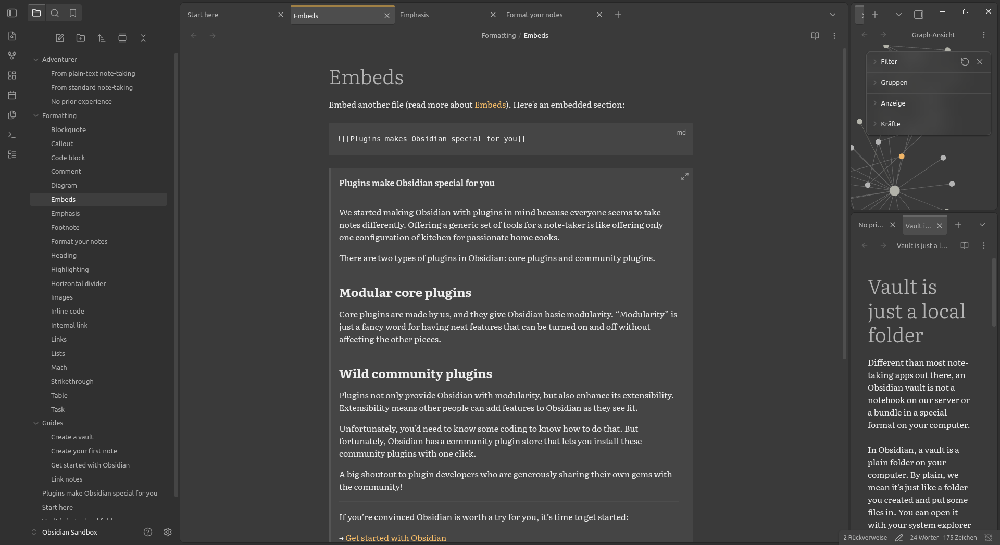

My personal Obsidian theme. Might break plugins. Low contrast or "soft" dark by design. Light theme WIP. **Not** tested on mobile or macOS. Probably a big kludge to someone who knows how to code.

# Feature
Side-dock makes use of Fitt's Law. Might not work with RTL-languages.

## Other features
Conforming to my weird aesthetic tastes.
## Planned features
I'd like to make a few things (e. g. transparency, contrast) toggle-able via Style Settings once I figure out how the YAML works. No infinite colour settings though. Maybe a blue tinted dark theme variant. Eventually, if there's time, I'd like to make a proper mobile version.
# Contributing
Feel free to create issues and pull requests. Please do alert me to issues with plugins and issues specific to your platform or language. Please be advised, though, that *I'm not a dev* and therefore I might ask stupid questions. 

However, as a precautionary measure **pull requests and issues written by generative AI will be rejected** to discourage spam. Also, as [one of the Typst maintainers said:](https://github.com/typst/typst/pull/7932)
>There is very limited value in having an external contributor as an intermediary between a maintainer and an AI model and AI-driven contributions can easily create a dangerous imbalance where a maintainer invests more time into a PR than the contributor themselves.
# Attributions
## Code
- Obsidian [Obsidian Sample Theme](https://github.com/obsidianmd/obsidian-sample-theme): This repo is based on it.
    - Modified
- Steve Schoger [Heropatterns](https://heropatterns.com/): Background image for modals
    - Licence: [CC-BY 4.0](https://creativecommons.org/licenses/by/4.0/)
    - Modified
## Inspiration
- Alexis C [Cupertino](https://github.com/aaaaalexis/obsidian-cupertino), Anubis [AnuPpuccin](https://github.com/AnubisNekhet/AnuPpuccin), Akifyss [Border](https://github.com/Akifyss/obsidian-border), Lucas Champagne [Encore](https://github.com/Carbonateb/obsidian-encore-theme): Island design for editor
- Mozilla [Firefox](https://www.firefox.com): Floating tabs